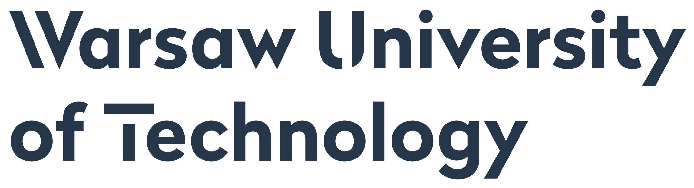

# MI²RedTeam  {.unnumbered #mi2redteam}

**MI²<strong>Red</strong>Team** analyses machine and deep learning predictive models through the lens of AI explainability, fairness, security and human trust. We develop methods and tools for explanatory model analysis and apply them in practice.

####  {-}

**MI²<strong>Red</strong>Team** is a group of researchers experienced in [XAI](https://doi.org/10.1007/978-3-031-04083-2_2) who perform a rigorous evaluation of AI solutions in order to improve their transparency and security. We apply state-of-the-art methods and introduce new ones to tailor our analysis to the specific predictive task. 

> We openly collaborate on various topics related to explainable and interpretable machine learning. Feel free to [reach out to us](mailto:przemyslaw.biecek@gmail.com) with research ideas and development opportunities. **We help organizations to better understand the vulnerabilities of their AI systems, and take steps to mitigate them.**

Our current *core* research topics of interest include:

- [**ARES**] Attack-Resistant Explanations towards Secure AI, i.e. a critical evaluation of the state-of-the-art analysis techniques 
- [**xSurvival**] Explanatory analysis of machine learning survival models
- [**Large Model Analysis**] Explanatory analysis of large models, e.g. transformers

**Methods and methodologies** introduced by our team:

- [Evaluating explanations of vision transformers](https://arxiv.org/abs/2304.06133)
- [InteractiveEMA](https://doi.org/10.1007/s10618-023-00924-w) towards human-model interaction in explainable machine learning for tabular data
- [SurvSHAP(t)](https://doi.org/10.1016/j.knosys.2022.110234) for time-dependent analysis of machine learning survival models
- [LIMEcraft](https://doi.org/10.1007/s10994-022-06204-w) for human-guided visual explanations of deep neural networks 
- [Fooling PD](https://doi.org/10.1007/978-3-031-26409-2_8) & [Manipulating SHAP](https://doi.org/10.1609/aaai.v36i11.21590) for stress-testing widely-applied explanation methods
- [Checklist](https://doi.org/10.1016/j.patcog.2021.108035) towards responsible deep learning on medical images
- [SAFE](https://doi.org/10.1016/j.dss.2021.113556) for lifting interpretability-performance trade-off via automated feature engineering
- [WildNLP](https://doi.org/10.1007/978-3-030-36718-3_20) for stress-testing deep learning models in NLP
- [Explanatory Model Analysis](https://ema.drwhy.ai) towards comprehensive examination of predictive models

**Tools** developed by our team:

- [DALEX](https://dalex.drwhy.ai), [breakDown](https://doi.org/10.32614/RJ-2018-072), [auditor](https://doi.org/10.32614/RJ-2019-036) & [modelStudio](https://github.com/ModelOriented/modelStudio) for explainable machine learning in R
- [dalex](https://www.jmlr.org/papers/v22/20-1473.html) for explainable and fair machine learning in Python
- [survex](https://github.com/modeloriented/survex) dedicated to explaining machine learning survival models
- [fairmodels](https://fairmodels.drwhy.ai) for fairness analysis of machine learning classification models

**Applications** supported by our team:

- In **medicine**, we analyzed hundreds of models predicting among others: [survival in uveal melanoma eye cancer](https://doi.org/10.1016/j.ejca.2022.07.031), [survival in sepsis](https://doi.org/10.3390/cells11152433), [type of lung cancer](https://doi.org/10.3390/cancers14020439), [lung cancer risk in screening](https://doi.org/10.3390/app12041926), [lung cancer mortality](https://doi.org/10.1007/978-3-030-37446-4_13), [COVID-19 mortality](https://doi.org/10.1609/aaai.v35i18.17874), [hospital length of stay](https://arxiv.org/abs/2303.09817), [progression of Alzheimer’s disease](https://doi.org/10.1186/s40708-022-00165-5).
- In **credit scoring**, we analyzed the [transparency, auditability, and explainability of machine learning models](https://doi.org/10.1080/01605682.2021.1922098).
- In **football analytics**, we analyzed [expected goal models for performance analysis](https://ieeexplore.ieee.org/document/10032440).
- ...

*This initiative is generously supported by the following institutions.*

     
    
    

    

