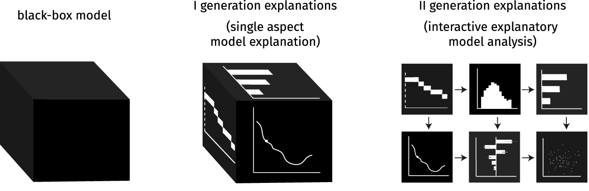

# MI²Research  {-}

On a mission to responsibly build  machine learning predictive models.

####   {-}

Responsible and sustainable predictive modelling is still a new and developing area. We are conducting a number of studies in this domain that examine predictive models applied to tabular data, computer vision or natural language processing models.  We investigate the stability and robustness of various methods, work on explainability and transparency for simple and complex models.

As part of our this effort, we develop open source software packages (usually in R and Python) for model explanatory analysis, publish scientific articles describing new methods or investigating properties of already known methods, and create educational materials, recommendations and examples of application in specific domains.

If you want to find out more about what we are working on, check out our seminar, which is always open to those interested in responsible and sustainable data science.

## Papers {-}

<a href="https://doi.org/10.1016/j.knosys.2022.110234 ">SurvSHAP(t): Time-dependent explanations of machine learning survival models</a>

Mateusz Krzyziński, Mikołaj Spytek, Hubert Baniecki, Przemysław Biecek

<i>Knowledge-Based Systems (2023)</i>

In this paper, we introduce SurvSHAP(t), the first time-dependent explanation that allows for interpreting survival black-box models. The proposed methods aim to enhance precision diagnostics and support domain experts in making decisions. SurvSHAP(t) is model-agnostic and can be applied to all models with functional output. We provide an accessible implementation of time-dependent explanations in Python at <a href="https://github.com/MI2DataLab/survshap">this URL</a>.

<a href="https://doi.org/10.1007/s10618-023-00924-w ">The grammar of interactive explanatory model analysis</a>

Hubert Baniecki, Dariusz Parzych, Przemyslaw Biecek

<i>Data Mining and Knowledge Discovery (2023)</i>

This paper proposes how different Explanatory Model Analysis (EMA) methods complement each other and discusses why it is essential to juxtapose them. The introduced process of Interactive EMA (IEMA) derives from the algorithmic side of explainable machine learning and aims to embrace ideas developed in cognitive sciences. We formalize the grammar of IEMA to describe human-model interaction. We conduct a user study to evaluate the usefulness of IEMA, which indicates that an interactive sequential analysis of a model may increase the accuracy and confidence of human decision making.

<a href="http://arxiv.org/abs/2211.05852 ">Climate Policy Tracker: Pipeline for automated analysis of public climate policies</a>

Artur Żółkowski, Mateusz Krzyziński, Piotr Wilczyński, Stanisław Giziński, Emilia Wiśnios, Bartosz Pieliński, Julian Sienkiewicz, Przemysław Biecek

<i>NeurIPS Workshop on Tackling Climate Change with Machine Learning (2022)</i>

In this work, we use a Latent Dirichlet Allocation-based pipeline for the automatic summarization and analysis of 10-years of national energy and climate plans (NECPs) for the period from 2021 to 2030, established by 27 Member States of the European Union. We focus on analyzing policy framing, the language used to describe specific issues, to detect essential nuances in the way governments frame their climate policies and achieve climate goals.

<a href="https://doi.org/10.1109/DSAA54385.2022.10032440">Explainable expected goal models for performance analysis in football analytics</a>

Mustafa Cavus, Przemyslaw Biecek

<i>International Conference on Data Science and Advanced Analytics (2022)</i>

The expected goal provides a more representative measure of the team and player performance which also suit the low-scoring nature of football instead of the score in modern football. This paper proposes an accurate expected goal model trained on 315,430 shots from seven seasons between 2014-15 and 2020-21 of the top-five European football leagues. Moreover, we demonstrate a practical application of aggregated profiles to explain a group of observations on an accurate expected goal model for monitoring the team and player performance.

 
<a href="https://doi.org/10.1038/s41598-022-21417-8">Multi-omics disease module detection with an explainable Greedy Decision Forest</a>

Bastian Pfeifer, Hubert Baniecki, Anna Saranti, Przemyslaw Biecek, Andreas Holzinger

<i>Scientific Reports (2022)</i>

In this work, we demonstrate subnetwork detection based on multi-modal node features using a novel Greedy Decision Forest (GDF) with inherent interpretability. The latter will be a crucial factor to retain experts and gain their trust in such algorithms. To demonstrate a concrete application example, we focus on bioinformatics, systems biology and particularly biomedicine, but the presented methodology is applicable in many other domains as well. Our proposed explainable approach can help to uncover disease-causing network modules from multi-omics data to better understand complex diseases such as cancer.

<a href="https://www.nature.com/articles/s42256-022-00531-2">Interpretable meta-score for model performance</a>

Alicja Gosiewska, Katarzyna Woźnica, Przemysław Biecek

<i>Nature Machine Intelligence (2022)</i>

Elo-based predictive power (EPP) meta-score that is built on other performance measures and allows for interpretable comparisons of models. Differences between this score have a probabilistic interpretation and can be compared directly between data sets. Furthermore, this meta-score allows for an assessment of ranking fitness. We prove the properties of the Elo-based predictive power meta-score and support them with empirical results on a large-scale benchmark of 30 classification data sets. Additionally, we propose a unified benchmark ontology that provides a uniform description of benchmarks.

<a href="http://doi.org/10.32614/RJ-2022-019">fairmodels: a Flexible Tool for Bias Detection, Visualization, and Mitigation in Binary Classification Models</a>

Jakub Wiśniewski, Przemyslaw Biecek

<i>The R Journal (2022)</i>

This article introduces an R package fairmodels that helps to validate fairness and eliminate bias in binary classification models quickly and flexibly. It offers a model-agnostic approach to bias detection, visualization, and mitigation. The implemented functions and fairness metrics enable model fairness validation from different perspectives. In addition, the package includes a series of methods for bias mitigation that aim to diminish the discrimination in the model. The package is designed to examine a single model and facilitate comparisons between multiple models.

<a href="https://doi.org/10.1186/s40708-022-00165-5">A robust framework to investigate the reliability and stability of explainable artificial intelligence markers of Mild Cognitive Impairment and Alzheimer’s Disease</a>

Angela Lombardi, Domenico Diacono, Nicola Amoroso, Przemysław Biecek, Alfonso Monaco, Loredana Bellantuono, Ester Pantaleo, Giancarlo Logroscino, Roberto De Blasi, Sabina Tangaro, Roberto Bellotti 

<i>Brain Informatics (2022)</i>

In this work, we present a robust framework to (i) perform a threefold classification between healthy control subjects, individuals with cognitive impairment, and subjects with dementia using different cognitive indexes and (ii) analyze the variability of the explainability SHAP values associated with the decisions taken by the predictive models. We demonstrate that the SHAP values can accurately characterize how each index affects a patient’s cognitive status. Furthermore, we show that a longitudinal analysis of SHAP values can provide effective information on Alzheimer’s disease progression.

<a href="https://link.springer.com/article/10.1007/s10994-022-06204-w">LIMEcraft: handcrafted superpixel selection and inspection for Visual eXplanations</a>

Weronika Hryniewska, Adrianna Grudzień, Przemysław Biecek

<i>Machine Learning (2022)</i>

LIMEcraft enhances the process of explanation by allowing a user to interactively select semantically consistent areas and thoroughly examine the prediction for the image instance in case of many image features. Experiments on several models show that our tool improves model safety by inspecting model fairness for image pieces that may indicate model bias. The code is available at: <a href="https://github.com/MI2DataLab/LIMEcraft">this URL</a>. 

<a href="https://arxiv.org/abs/2105.12837">Fooling Partial Dependence via Data Poisoning</a>

Hubert Baniecki, Wojciech Kretowicz, Przemyslaw Biecek

<i>ECML PKDD (2022)</i>

We showcase that PD can be manipulated in an adversarial manner, which is alarming, especially in financial or medical applications where auditability became a must-have trait supporting black-box machine learning. The fooling is performed via poisoning the data to bend and shift explanations in the desired direction using genetic and gradient algorithms.

<a href="https://doi.org/10.1609/aaai.v36i11.21590">Manipulating SHAP via Adversarial Data Perturbations (Student Abstract)</a>

Hubert Baniecki, Przemyslaw Biecek

<i>AAAI Conference on Artificial Intelligence (2022)</i>

We introduce a model-agnostic algorithm for manipulating SHapley Additive exPlanations (SHAP) with perturbation of tabular data. It is evaluated on predictive tasks from healthcare and financial domains to illustrate how crucial is the context of data distribution in interpreting machine learning models. Our method supports checking the stability of the explanations used by various stakeholders apparent in the domain of responsible AI; moreover, the result highlights the explanations' vulnerability that can be exploited by an adversary.

<a href="https://www.mdpi.com/2072-6694/14/2/439">A Signature of 14 Long Non-Coding RNAs (lncRNAs) as a Step towards Precision Diagnosis for NSCLC</a>

Anetta Sulewska, Jacek Niklinski, Radoslaw Charkiewicz, Piotr Karabowicz, Przemyslaw Biecek, Hubert Baniecki, Oksana Kowalczuk, Miroslaw Kozlowski, Patrycja Modzelewska, Piotr Majewski et al.

<i>Cancers (2022)</i>

The aim of the study was the appraisal of the diagnostic value of 14 differentially expressed long non-coding RNAs (lncRNAs) in the early stages of non-small-cell lung cancer (NSCLC). We established two classifiers. The first recognized cancerous from noncancerous tissues, the second successfully discriminated NSCLC subtypes (LUAD vs. LUSC). Our results indicate that the panel of 14 lncRNAs can be a promising tool to support a routine histopathological diagnosis of NSCLC.

<a href="https://www.jmlr.org/papers/v22/20-1473">dalex: Responsible Machine Learning with Interactive Explainability and Fairness in Python</a>

Hubert Baniecki, Wojciech Kretowicz, Piotr Piątyszek, Jakub Wiśniewski, Przemyslaw Biecek

<i>Journal of Machine Learning Research (2021)</i>

We introduce dalex, a Python package which implements a model-agnostic interface for interactive explainability and fairness. It adopts the design crafted through the development of various tools for explainable machine learning; thus, it aims at the unification of existing solutions. This library's source code and documentation are available under open license at <a href="https://python.drwhy.ai">this URL</a>.

<a href="https://www.sciencedirect.com/science/article/pii/S0031320321002223">Checklist for responsible deep
learning modeling of medical images based on COVID-19 detection studies</a>

Weronika Hryniewska, Przemysław Bombiński, Patryk Szatkowski, Paulina Tomaszewska, Artur Przelaskowski,
Przemysław Biecek

<i>Pattern Recognition (2021)</i>

Our analysis revealed numerous mistakes made at different stages of data acquisition, model development, and explanation construction. In this work, we overview the approaches proposed in the surveyed Machine Learning articles and indicate typical errors emerging from the lack of deep understanding of the radiography domain. The final result is a proposed checklist with the minimum conditions to be met by a reliable COVID-19 diagnostic model.

<a href="https://arxiv.org/abs/2002.04276">Towards explainable meta-learning</a>

Katarzyna Woźnica, Przemyslaw Biecek

<i>ECML PKDD Workshop on eXplainable Knowledge Discovery in Data Mining (2021)</i>

To build a new generation of meta-models we need a deeper understanding of the importance and effect of meta-features on the model tunability. In this paper, we propose techniques developed for eXplainable Artificial Intelligence (XAI) to examine and extract knowledge from black-box surrogate models. To our knowledge, this is the first paper that shows how post-hoc explainability can be used to improve the meta-learning.

<a href="https://drive.google.com/file/d/1-B5T3FCAHzDJbOaPtBnf5l9NnK-yhJtZ/view">Prevention is better than cure: a
case study of the abnormalities detection in the chest</a>

Weronika Hryniewska, Piotr Czarnecki, Jakub Wiśniewski, Przemysław Bombiński, Przemysław Biecek

<i>CVPR Workshop on “Beyond Fairness: Towards a Just, Equitable, and Accountable Computer Vision” (2021)</i>

In this paper, we analyze in detail a single use case - a Kaggle competition related to the detection of abnormalities in X-ray lung images. We demonstrate how a series of simple tests for data imbalance exposes faults in the data acquisition and annotation process. Complex models are able to learn such artifacts and it is difficult to remove this bias during or after the training. 

<a href="https://www.sciencedirect.com/science/article/pii/S016792362100066X">Simpler is better: Lifting interpretability-performance trade-off via automated feature engineering</a>

Alicja Gosiewska, Anna Kozak, Przemysław Biecek

<i>Decision Support Systems (2021)</i>

We propose a framework that uses elastic black boxes as supervisor models to create simpler, less opaque, yet still accurate and interpretable glass box models. The new models were created using newly engineered features extracted with the help of a supervisor model. We supply the analysis using a large-scale benchmark on several tabular data sets from the OpenML database. 

<a href="https://www.sciencedirect.com/science/article/pii/S1896112621000201">The first SARS-CoV-2 genetic variants
of concern (VOC) in Poland: The concept of a comprehensive approach to monitoring and surveillance of emerging
variants</a>

Radosław Charkiewicz, Jacek Nikliński, Przemysław Biecek, Joanna Kiśluk, Sławomir Pancewicz, Anna
Moniuszko-Malinowska, Robert Flisiak, Adam Krętowski, Janusz Dzięcioł, Marcin Moniuszko, Rafał Gierczyński,
Grzegorz Juszczyk, Joanna Reszeć

<i>Advances in Medical Sciences (2021)</i>

This study shows the first confirmed case of SARS-CoV-2 in Poland with the lineage B.1.351 (known as 501Y.V2 South African variant), as well as another 18 cases with epidemiologically relevant lineage B.1.1.7, known as British variant.

<a href="https://ojs.aaai.org/index.php/AAAI/article/view/17874">Responsible Prediction Making of COVID-19 Mortality
(Student Abstract)</a>

Hubert Baniecki, Przemyslaw Biecek

<i>AAAI Conference on Artificial Intelligence (2021)</i>

During the literature review of COVID-19 related prognosis and diagnosis, we found out that most of the predictive models are not faithful to the RAI principles, which can lead to biassed results and wrong reasoning. To solve this problem, we show how novel XAI techniques boost transparency, reproducibility and quality of models.

<a href="https://link.springer.com/chapter/10.1007%2F978-3-030-36718-3_20">Models in the Wild: On Corruption Robustness of Neural NLP Systems</a>

Barbara Rychalska, Dominika Basaj, Alicja Gosiewska, Przemyslaw Biecek

<i>International Conference on Neural Information Processing (2019)</i>

Natural Language Processing models lack a unified approach to robustness testing. In this paper we introduce WildNLP - a framework for testing model stability in a natural setting where text corruptions such as keyboard errors or misspelling occur. We compare robustness of deep learning models from 4 popular NLP tasks: Q&A, NLI, NER and Sentiment Analysis by testing their performance on aspects introduced in the framework. In particular, we focus on a comparison between recent state-of-the-art text representations and non-contextualized word embeddings. In order to improve robustness, we perform adversarial training on selected aspects and check its transferability to the improvement of models with various corruption types. We find that the high performance of models does not ensure sufficient robustness, although modern embedding techniques help to improve it. We release the code of WildNLP framework for the community.

<a href="https://doi.org/10.32614/RJ-2019-036">auditor: an R Package for Model-Agnostic Visual Validation and Diagnostics</a>

Alicja Gosiewska, Przemyslaw Biecek

<i>The R Journal (2019)</i>

Machine learning models have successfully been applied to challenges in applied in biology, medicine, finance, physics, and other fields. With modern software it is easy to train even a complex model that fits the training data and results in high accuracy on test set. However, problems often arise when models are confronted with the real-world data. This paper describes methodology and tools for model-agnostic auditing. It provides functinos for assessing and comparing the goodness of fit and performance of models. In addition, the package may be used for analysis of the similarity of residuals and for identification of outliers and influential observations. The examination is carried out by diagnostic scores and visual verification. The code presented in this paper are implemented in the auditor package. Its flexible and consistent grammar facilitates the validation models of a large class of models.

<a href="https://doi.org/10.32614/RJ-2018-072">Explanations of Model Predictions with live and breakDown Packages</a>

Mateusz Staniak, Przemyslaw Biecek

<i>The R Journal (2018)</i>

Complex models are commonly used in predictive modeling. In this paper we present R packages that can be used for explaining predictions from complex black box models and attributing parts of these predictions to input features. We introduce two new approaches and corresponding packages for such attribution, namely live and breakDown. We also compare their results with existing implementations of state-of-the-art solutions, namely, lime (Pedersen and Benesty, 2018) which implements Locally Interpretable Model-agnostic Explanations and iml (Molnar et al., 2018) which implements Shapley values.

<a href="https://www.jmlr.org/papers/v22/20-1473">DALEX: Explainers for Complex Predictive Models in R</a>

Przemyslaw Biecek

<i>Journal of Machine Learning Research (2018)</i>

This paper describes a consistent collection of explainers for predictive models, a.k.a. black boxes. Each explainer is a technique for exploration of a black box model. Presented approaches are model-agnostic, what means that they extract useful information from any predictive method irrespective of its internal structure. Each explainer is linked with a specific aspect of a model. Every explainer presented here works for a single model or for a collection of models. In the latter case, models can be compared against each other. Presented explainers are implemented in the DALEX package for R. They are based on a uniform standardized grammar of model exploration which may be easily extended.

<a href="https://github.com/pbiecek/archivist">archivist: An R Package for Managing, Recording and Restoring Data Analysis Results</a>

Przemyslaw Biecek, Marcin Kosiński

<i>Journal of Statistical Software (2017)</i>

Everything that exists in R is an object (Chambers 2016). This article examines what would be possible if we kept copies of all R objects that have ever been created. Not only objects but also their properties, meta-data, relations with other objects and information about context in which they were created. We introduce archivist, an R package designed to improve the management of results of data analysis.

## Software {-}

<a href="http://dalex.drwhy.ai/">DALEX</a>

XAI with DALEX for R and Python

<a href="https://modeloriented.github.io/survex/">survex</a>

Explainable machine learning in survival analysis

<a href="https://arena.drwhy.ai/docs/">Arena</a>

Interactive tool for the exploration and comparison of models' explanations

<a href="https://modeloriented.github.io/fairmodels/">fairmodels</a>

Fairness with fairmodels

<a href="https://crs19.pl/">COVID-19</a>

COVID-19 Risk Score

<a href="https://github.com/pbiecek/archivist">archivist</a>

Model governance with R (MLOps)

## Books {-}

<a href="https://pbiecek.github.io/ema/">Explanatory Model Analysis</a>

Explore, Explain, and Examine Predictive Models. With examples in R and Python

Przemysław Biecek, Tomasz Burzykowski

<i>Chapman and Hall/CRC, New York (2021)</i>

<a href="http://www.biecek.pl/Eseje/">Odkrywać! Ujawniać! Objaśniać! Zbiór esejów o sztuce prezentowania danych</a>

Essays on the art of data visualisation

Przemysław Biecek

<i>WUW (2016)</i>

<a href="http://www.biecek.pl/Analiza.Danych/">Analiza danych z programem R. Modele liniowe z efektami stałymi, losowymi i mieszanymi</a>

Data analysis in R. Linear models with fixed, random and mixed effects

Przemysław Biecek

<i>PWN (2013)</i>

## Seminars {-}

We meet every Monday, at 10 am online or in MI2DataLab (room 044, Faculty of Mathematics and Information Science, Warsaw University of Technology).

Join us at https://meet.google.com/nno-okiz-bxy (or http://meet.drwhy.ai/)

List of topics and materials from past seminars: https://github.com/MI2DataLab/MI2DataLab_Seminarium

## Research grants  {-}

### ARES 2022-2026 {-}

#### ARES: Attack-resistant Explanations toward Secure and trustworthy AI {-}

Machine learning explainability, fairness, robustness, and security are key elements of trustworthy Artificial
Intelligence, an area of strategic importance. In this context, the main goals of the ARES project are:

1. Develop adversarial attacks on state-of-the-art explanations to investigate vulnerabilities and
limitations of the existing explainability and fairness approaches in machine learning.
2. Introduce novel robust explanations that are stable against manipulation and intuitive to evaluate.

Achieving the first goal primarily impacts various domains of research, which currently use (and explain) black-box models for knowledge discovery and decision-making, by highlighting vulnerabilities and limitations of their explanations. Achieving the second goal impacts more the broad machine learning domain as it aims at improving state-of-the-art by introducing robust explanations toward secure and trustworthy AI.

**Work on this project is financially supported from the Preludium Bis grant 2021/43/O/ST6/00347 funded by Polish National Science Centre (NCN).**

### DARLING 2022-2024   {-}

#### DARLING: Deep Analysis of Regulations with Language Inference, Network analysis and institutional Grammar  {-}

**Aim of the project**

Developing the tools for automated analysis of content of legal documents leveraging Natural Language Processing, that will help understand the dynamic of change in public policies and variables influencing those changes.

Those tools will be firstly used to analyse the case of development of policy subsystem regulating usage of AI in the European Union. 

**Specific goals of the project**

1. Developing and evaluating multilingual models for issue classification for legal and public policy documents.
2. Developing embedding-based topic modeling methods for legal and public policy documents suited for analysis of change of the topics between documents.
3. Institutional grammar based analysis of changes in topics between different public policy documents, regulations and public consultation documents.
4. Agent-based models predicting diffusion of issues in public policy documents.

**Methodology**

The core of the DARLING project is the issues and topic analysis in documents connected with regulations development using NLP tools. Issues analysis shall allow tracking how different options of AI operationalisation, ways the AI-connected threats are perceived as well as ideas regarding AI regulations are shared among three different types of texts: scientific, expert and legal ones. The extracted issues will then be subject to complex networks analysis and institutional grammar approach. The network analysis, backed by agent-based modeling, will be used to examine the flow of issues among the documents based on their vector-formed characteristics. On the other hand, the Institutional Grammar (IG) will be used to analyze the modality of issues, e.g., the tendency to regulate a specific aspect of AI in a given issue, its deontic character or its conditionality.

In result the DARLING project will effect in the development of new methods to analyze legal documents connected to regulation based on deep text processing and links among the documents. An inter-institutional and interdisciplinary team of computer, political sciences and physics of complex systems scientists will elaborate new machine learning approaches to examine the regulation corpora, issues recognition, issues analysis by the means of IG as well as propose new methods of modeling the flow/changes of regulations based on complex networks tools.

### X-LUNGS 2021-2024 {-}

#### X-LUNGS: Responsible Artificial Intelligence for Lung Diseases {-}

[comment]: <> ()

The aim of the project is to support the process of identification of lesions visible on CT and lung x-rays. We intend to achieve this goal by building an information system based on artificial intelligence (AI) that will support the radiologist's work by enriching the images with additional information.

The unique feature of the proposed system is a trustworthy artificial intelligence module that:

- will reduce the image analysis time needed to detect lesions,
- will make the image evaluation process more transparent,
- will provide image and textual explanations indicating the rationale behind the proposed recommendation,
- will be verified for effective collaboration with the radiologist.

**Work on this project is financially supported from the INFOSTRATEG-I/0022/2021-00 grant funded by Polish National Centre for Research and Development (NCBiR).**

### HOMER 2020-2025 {-}

#### HOMER: Human Oriented autoMated machinE leaRning {-}

One of the biggest challenges in the state-of-the-art machine learning is dealing with the complexity of predictive models. Recent techniques like deep neural networks, gradient boosting or random forests create models with thousands or even millions of parameters. This makes decisions generated by these black-box models completely opaque. Model obscurity undermines trust in model decisions, hampers model debugging, blocks model auditability, exposes models to problems with concept drift or data drift.

Recently, there has been a huge progress in the area of model interpretability, which results in the first generation of model explainers, methods for better understanding of factors that drive model decisions. Despite this progress, we are still far from methods that provide deep explanations, confronted with domain knowledge that satisfies our ,,Right to explanation'' as listed in the General Data Protection Regulation (GDPR).

In this project I am going to significantly advance next generation of explainers for predictive models. This will be a disruptive change in the way how machine learning models are created, deployed, and maintained. Currently to much time is spend on handcrafted models produced in a tedious and laborious try-and-error process. The proposed Human-Oriented Machine Learning will focus on the true bottleneck in development of new algorithms, i.e. on model-human interfaces.

The particular directions I consider are (1) developing an uniform grammar for visual model exploration, (2) establishing a methodology for contrastive explanations that describe similarities and differences among different models, (3) advancing a methodology for non-additive model explanations, (4) creating new human-model interfaces for effective communication between models and humans, (5) introducing new techniques for training of interpretable models based on elastic surrogate black-box models, (6) rising new methods for automated auditing of fairness, biases and performance of predictive models.

**Work on this project is financially supported from the Sonata Bis-9 grant 2019/34/E/ST6/00052 funded by Polish National Science Centre (NCN).**

### DeCoviD 2020-2022 {-}

#### DeCoviD: Detection of Covid-19 related markers of pulmonary changes using Deep Neural Networks models supported by eXplainable Artificial Intelligence and Cognitive Compressed Sensing  {-}

 
 

Covid-19 is an infectious respiratory disease. A coronavirus infection leaves permanent ramifications in the respiratory system and beyond. In this situation, tools supporting diagnosis and assessment of lung damage after infection and during Covid-19 treatment are crucial. Preliminary results of analysis of CT images and lung xrays suggest that they can help to quickly assess even asymptomatic cases and facilitate prognosis of response to treatment. There are also reports of usefulness of ultrasound images.

The aim of the DeCoviD project is to develop methods and tools to support radiologists in the assessment of lung imaging data for the occurrence of changes caused by Covid-19 disease. The developed solution will allow to automate the identification of pathological changes and will support the diagnosis of coexisting lung diseases as well as diseases of other organs visible on chest images. It will also allow to quantify the severity of lung damage caused by the disease

Responsible decision support for radiologists requires models based on interpretable features. Such features will be stored in a hybrid knowledge base powered by two research teams from WUT, working on the basis of two, seemingly opposite, paradigms of image data analysis. The eXplainable Artificial Intelligence (XAI) team will use trained deep networks to automatically extract features that are essential for effective disease detection. Cognitive Compressed Sensing (CCS) will build a set of interpretable semantic features using sparse cognitive representations agreed with a group of cooperating radiologists. Combining these two approaches will achieve high effectiveness of the constructed models, combined with high transparency, clarity and stability of the solution.

The DeCoviD project is a part of a broader strategy of competence development in the area of deep learning + XAI + medical applications at the Warsaw University of Technology.

More information: https://github.com/MI2DataLab/DeCoviD.

**Work on this project is financially supported by the IDUB against COVID PW.**

### DALEX 2018-2022  {-}

#### DALEX: Descriptive and model Agnostic Local EXplanations {-}

**Research project objectives.** Black boxes are complex machine learning models, for example deep neural network, an ensemble of trees of high-dimensional regression model. They are commonly used due to they high performance. But how to understand the structure of a black-box, a model in which decision rules are too cryptic for humans? The aim of the project is to create a methodology for such exploration. To address this issue we will develop methods, that: (1) identify key variables that mostly determine a model response, (2) explain a single model response in a compact visual way through local approximations, (3) enrich model diagnostic plots.

**Research project methodology.** This project is divided into three subprojects - local approximations od complex models (called LIVE), explanations of particular model predictions (called EXPLAIN) and conditional explanations (called CONDA).

**Expected impact on the development of science.** Explanations of black boxes have fundamental implications for the field of predictive and statistical modelling. The advent of big data forces imposes usage of black boxes that are easily able to overperform classical methods. But the high performance itself does not imply that the model is appropriate. Thus, especially in applications to personalized medicine or some regulated fields, one should scrutinize decision rules incorporated in the model. New methods and tools for exploration of black-box models are useful for quick identification of problems with the model structure and increase the interpretability of a black-box

**Work on this project is financially supported from the Opus grant 2017/27/B/ST6/01307 funded by Polish National Science Centre (NCN).**

### MLGenSig 2017-2021   {-}

#### MLGenSig: Machine Learning Methods for building of Integrated Genetic Signatures  {-}

**Research project objectives.** The main scientific goal of this project is to develop a methodology for integrated genetic signatures based on data from divergent high-throughput techniques used in molecular biology. Integrated signatures base on ensembles of signatures for RNA-seq, DNA-seq, data as well for methylation profiles and protein expression microarrays. The advent of high throughput methods allows to measure dozens of thousands or even millions features on different levels like DNA / RNA / protein. And nowadays in many large scale studies scientists use data from mRNA seq to assess the state of transcriptome, protein microarrays to asses the state of proteome and DNA-seq / bisulfide methylation to assess genome / methylome.

**Research methodology.** Genetic signatures are widely used in different applications, among others: for assessing genes that differentiate cells that are chemo resistant vs. cells that are not, assess the stage of cell pluripotency, define molecular cancer subtypes. For example, in database Molecular Signatures Database v5.0 one can find thousands of gene sets - genetic signatures for various conditions. There are signatures that characterize some cancer cells, pluripotent cells and other groups. But they usually contain relatively small number of genes (around 100), results with them are hard to replicate and they are collection of features that were found significant when independently tested. In most cases signatures are derived from measurements of the same type. Like signatures based of expression of transcripts based on data from microarrays or RNA-seq, or methylation profile or DNA variation. We are proposing a very different approach. First we are going to use machine-learning techniques to create large collections of signatures. Such signatures base on ensembles of small sub-signatures, are more robust and usually have higher precision. Then out of such signatures we are going to develop methodology for meta-signatures, that integrate information from different types of data (transcriptome, proteome, genome). Great examples of such studies are: Progenitor Cell Biology Consortium (PCBC) and The Cancer  Genome Atlas (TCGA) studies. For thousands of patients in different cohorts (for PCBC cohorts based on stemness phenotype, for TCGA based on cancer type) measurements of both mRNA, miRNA, DNA and methylation profiles are available. New, large datasets require new methods that take into account high and dense structure of dependencies between features. The task that we are going to solve is to develop methodology that will create genetic signatures that integrate information from different levels of cell functioning. Then we are going to use data from TCGA and PBCB project to assess the quality of proposed methodology. As a baseline we are going to use following methodologies: DESeq, edgeR (for mRNA), casper (for lternative splicing), MethylKit (for RRBS data) and RPPanalyzer for protein arrays.

Here is the skeleton for our approach: (1) Use ensembles in order to building a genetic signature. The first step would be to use random forests to train a new signature. Ensembles of sub-signtures are build on bootstrap subsamples and they votes if given sample fit given signature or not. (2) In order to improve signatures we are going to consider various normalization of raw counts. We start with log and rank transformation. (3) In order to improve the process of training an ensemble we are going to use pre-filtering of genes. (4) Another approach is to use Bayesian based methods, that may incorporate the expert knowledge, like belief-based gaussian modelling

**Research project impact.** Genetic profiling is more and more important and has number of application starting from basic classification up to personalized medicine in which patients are profiled against different signatures. Existing tools for genetic signatures have many citations. This we assume that the methodology for integrated genetic profiling will be a very useful for many research groups. It is hard to overestimate the impact of better genetic profiling on medicine. Moreover we build a team of people with knowledge in cancer genetic profiling

**Work on this project is financially supported from the Opus grant 2016/21/B/ST6/02176 funded by Polish National Science Centre (NCN).**

