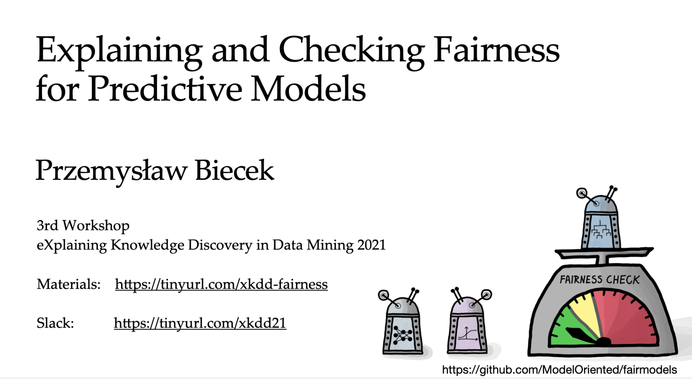

# MI²Solutions  {-}

The methods we work on are based on principles of open science. And are available to everyone

The tools we develop are created in the spirit of open software. And are available to everyone

If you need tailor-made solutions for your individual needs, we are happy to help you too. Contact us, we can develop software for you, deploy it, provide training, discuss your needs, verify the quality of your existing solutions.

Below you will find a sample offer for trainings or deployments.

## Solutions  {-}

Our team has experience not only in groundbreaking research, but also in deploying these research into business.

We help in delivery of champion-challenger evaluations in which we look for potential to increase the effectiveness of predictive models in your company.

We take care of the whole life cycle of the predictive models, from reproducibility of results to constant monitoring and continuous improvement of the model.

We audit models and analyse the sensitivity and vulnerability of the model to incorrect or unexpected behaviours.

We would be happy to discuss how we could help with your organisation!

## Trainings {-}

We conduct trainings for data-science teams interested in the latest results in the area of responsible predictive modelling.

 
 

### DALEX for R {-}
#### Explanation and exploration of machine learning models with R and DALEX {-}

A brief introduction to tools for local and global explanations of predictive models using the DALEX library. The short version is 3 hours, the long version is a 2-day training. During the training you will build several predictive models and take a closer look at how they work.

Find more materials here: https://github.com/pbiecek/XAIatERUM2020

### Fairmodels {-}
#### Explaining and Checking Fairness for Predictive Models {-}

The tutorial is divided into three parts. First, I talk about fairness in general. Do we have a problem with discrimination, and which areas are affected by it? The second part is related to fairness measures. We  discuss the most common statistics for the detection of discrimination. The third part is the hands-on presentation of software that helps to check and visualize fairness.

Find more materials here: https://github.com/pbiecek/fairness_xkdd_2021

