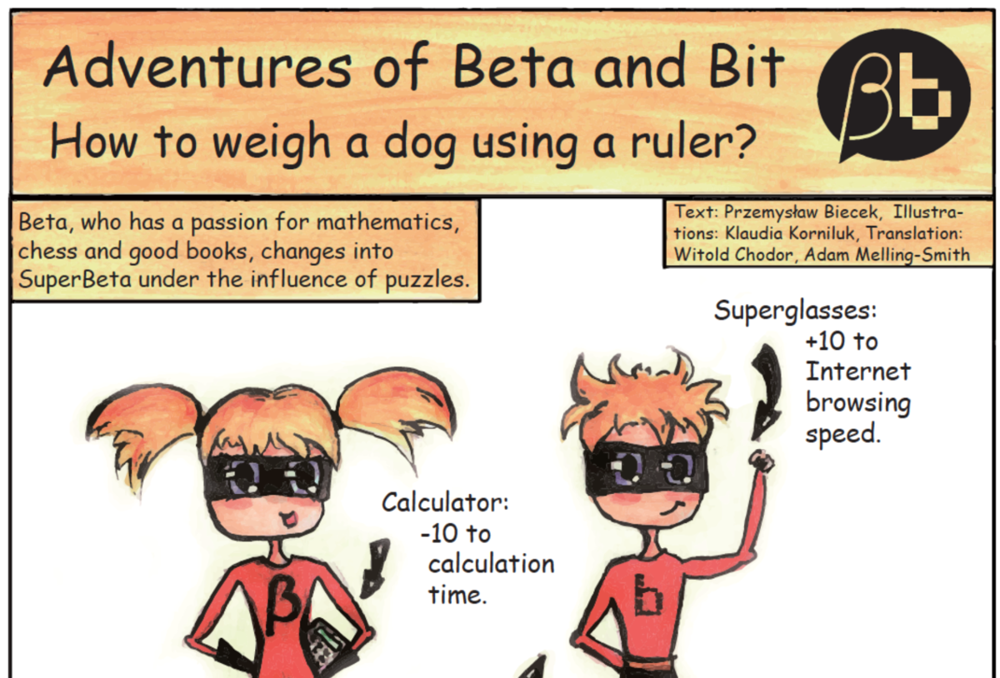
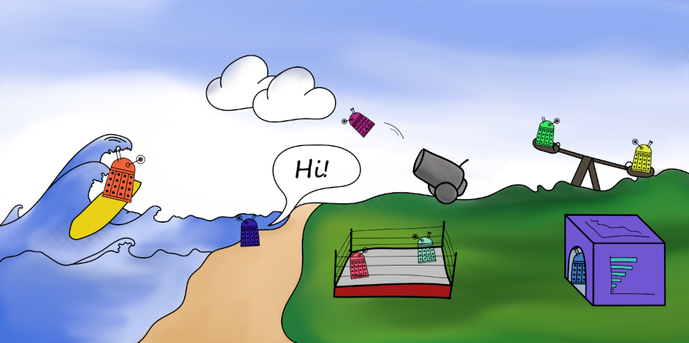

# MI²Education {-}

The demand for predictive modelling skills is growing at a furious rate. Part of our mission is to develop human capital so that predictive modelling is applied responsibly and safely.

We take social responsibility seriously and as part of our activities we support the development of data analysis skills among pupils, students and senior professionals alike.

## Teaching {-}

### Data Visualization 21/22 Winter {-}

[Data Visualization Techniques](https://github.com/mini-pw/2022Z-DataVisualizationTechniques) for Data Science studies

- lectures, labs, projects - Anna Kozak
- labs, projects - Hubert Baniecki

### Exploratory Data Analysis 20/21 Summer {-}

[Introduction to exploratory data analysis](https://github.com/mini-pw/2021L-ExploratoryDataAnalysis) for Mathematics and data analysis studies

- lectures, labs, projects - Anna Kozak
- labs - *Krzysztof Spaliński*

### Case Studies 20/21 Summer {-}

[Case Studies](https://github.com/mini-pw/2021L-WarsztatyBadawcze) for Data Science studies

- lectures - Katarzyna Woźnica
- [XAI1](https://github.com/mini-pw/2021L-WB-XAI-1) - labs, projects - Anna Kozak
- [XAI2](https://github.com/mini-pw/2021L-WB-XAI-2) - labs, projects - Szymon Maksymiuk
- [DL1](https://github.com/mini-pw/2021L-WB-DL-1) - labs, projects - Weronika Hryniewska
- [DL2](https://github.com/mini-pw/2021L-WB-DL-2) - labs, projects - Paulina Tomaszewska
- [ML](https://github.com/mini-pw/2021L-WB-ML) - labs, projects - Hubert Baniecki
- [RashomonML](https://github.com/mini-pw/2021L-WB-RashomonML) - labs, projects - Katarzyna Woźnica

### Data Visualization 20/21 Winter {-}

[Data Visualization Techniques](https://github.com/mini-pw/2021Z-DataVisualizationTechniques) for Data Science studies

- lectures, labs - Alicja Gosiewska
- projects - Hubert Baniecki

### Case Studies 19/20 Summer {-}

[Case Studies](https://github.com/mini-pw/2020L-WarsztatyBadawcze) for Data Science studies

- lectures - Alicja Gosiewska
- [Imputation](https://github.com/mini-pw/2020L-WarsztatyBadawcze-Imputacja) - labs, projects - Katarzyna Woźnica
- [Reproducibility of scientific papers](https://github.com/mini-pw/2020L-WarsztatyBadawcze-Reprodukowalnosc) - labs, projects - Alicja Gosiewska
- [Interpretability](https://github.com/mini-pw/2020L-WarsztatyBadawcze-InzynieriaCech) - labs, projects - Katarzyna Kobylińska

### Interpretable Machine Learning 19/20 Summer {-}

[Interpretable Machine Learning](https://github.com/pbiecek/InterpretableMachineLearning2020) for Data Science studies

- lectures, projects - Przemysław Biecek

### Data Visualization 19/20 Summer {-}

[Data Visualization](https://github.com/mini-pw/2020L-WizualizacjaDanych) for Data Science studies

- lectures, labs, projects - Michał Burdukiewicz

## Beta Bit {-}

<a href="https://betaandbit.github.io/RML/">The Hitchhiker's Guide to Responsible Machine Learning</a>

EN: A one-of-a-kind 52-page story about responsible machine learning. Beta and Bit use decision trees, random forests, and AutoML tools to build a risk model after a covid infection, and then use explainable artificial intelligence tools to analyze the behavior of that model. The description of the data analysis process is intertwined with descriptions of ML tools and code snippets. All examples are fully reproducible!

PL: Jedyna w swoim rodzaju 52-stronicowa opowieść o odpowiedzialnym uczeniu maszynowym. Beta i Bit używają drzew decyzyjnych, lasów losowych i narzędzi AutoML do budowy modelu ryzyka po zakażeniu covid, a następnie używają narzędzi wyjaśnialnej sztucznej inteligencji by przeanalizować działanie tego modelu. Opis procesu analizy danych przeplata się na opisem kolejnych narzędzi i przykładami kodu. Wszystkie wyniki są całkowicie odtwarzalne!

<a href="https://betaandbit.github.io/RML/">Flipbook online</a>

Przemysław Biecek, Anna Kozak, Aleksander Zawada

Fundacja Naukowa SmarterPoland.pl. <i>2022</i>

<a href="#">W pogoni za nieskończonością. Szeregi</a>

EN: What does hiking in the mountains have to do with the convergence of series? Quite a lot! We start with the paradoxes related to infinity, but step by step we learn the techniques of geometric series. In this book, the conditions for convergence are explained, together with numerous examples. The comic ends with a collection of exercises with different levels of difficulty.

PL: Co wspólnego ma chodzenie po górach ze zbieżnością szeregów? Otóż całkiem sporo! Zaczynamy od paradoksów związanych z nieskończonością, ale krok po kroku poznajemy techniki szeregów geometrycznych. W tej pozycji wyjaśnione są warunki zbieżności wraz z licznymi przykładami. Komiks kończy zbiór zadań o różnych poziomach trudności.

<a href="https://betaandbit.github.io/Szeregi/">Flipbook online</a>

Przemysław Biecek, Łukasz Maciejewski, Aleksander Zawada

Fundacja Naukowa SmarterPoland.pl. <i>2022</i>

<a href="https://www.wuw.pl/product-pol-8576-Wykresy-unplugged.html">Wykresy unplugged</a>

EN: Can you create clear charts without any electricity? An illustrated collection of exercises showing eight of the most popular ways to visualise data, with do-it-yourself challenges. Grab your crayons and start creating fantastic charts.

PL: Czy można tworzyć czytelne wykresy bez użycia prądu? Ilustrowany zbiór ćwiczeń przedstawiających osiem najpopularniejszych sposobów wizualizacji danych, wraz z zadaniami do samodzielnego wykonania. Weź kredki i zacznij tworzyć fantastyczne wykresy.

<a href="https://betaandbit.github.io/WykresyUnplugged/">Flipbook online</a>, <a href="https://ksiegarnia.pwn.pl/Wykresy-unplugged,771536924,p.html">Komiks w księgarnii</a>.

Przemysław Biecek, Ewa Baranowska, Piotr Sobczyk

Fundacja Naukowa SmarterPoland.pl. <i>2018</i>

<a href="https://www.wuw.pl/product-pol-8579-W-pogoni-za-nieskonczonoscia.html">W pogoni za nieskończonością</a>

EN: Two mathematicians share stories about infinity. In the first Beta attends a lecture on the properties of prime numbers. In the second, Bit breaks into the Palace of Culture and Science. How should we talk about mathematics?

PL: Dwójka matematyków wymienia się opowiadaniami o nieskończoności. W pierwszym Beta bierze udział w wykładzie o właściwościach liczb pierwszych. W drugim Bit włamuje się do Pałacu Kultury i Nauki. Jak opowiadać o matematyce?

<a href="https://betaandbit.github.io/Nieskonczonosc/">Flipbook online</a>, <a href="https://www.wuw.pl/product-pol-8579-W-pogoni-za-nieskonczonoscia.html">Komiks w księgarnii</a>.

Przemysław Biecek, Łukasz Maciejewski, Tomasz Samojlik, Sebastian Szpakowski

Fundacja Naukowa SmarterPoland.pl. <i>2018</i>

<a href="https://www.empik.com/jak-dlugo-zyja-muffinki-biecek-przemyslaw,p1135934167,ksiazka-p">Jak długo żyją Muffinki?</a>

EN: A collection of three stories for children showing statistical relationships in the world around us. Beautifully illustrated stories about the distribution of height according to age, the life span of dogs or measuring the weight of trees.

PL: Zbiór trzech opowiadań dla dzieci pokazującym zależności statystyczne w świecie wokół nas. Pięknie ilustrowane opowiadania o rozkładzie wzrostu w zależności od wieku, czasie życia psów czy pomiarze wagi drzew.

Online: <a href="http://betabit.wiki/story/muffinkiRozdzial1.pdf">Jak szybko urosnę</a>, <a href="http://betabit.wiki/story/muffinkiRozdzial2.pdf">Jak długo żyją Muffinki</a>.

Przemysław Biecek

Fundacja Naukowa SmarterPoland.pl.<i>2016</i>

<a href="https://www.empik.com/pieczara-pietraszki-chudzian-magdalena-biecek-przemyslaw,p1119203030,ksiazka-p">Pieczara Pietraszki</a>

EN: How linear regression can help in getting home, and why it's not worth hacking into a mad mathematician's office. A short story describing the adventures of two teenagers Beta and Bit moving around historic Warsaw.

PL: W jaki sposób regresja liniowa może pomóc w powrocie do domu, oraz dlaczego nie warto włamywać się do pokoju szalonego matematyka? Lekkie opowiadanie opisujące przygody dwójki nastolatków Bety i Bita w historycznej Warszawie.

Online: <a href="http://biecek.pl/BetaBit/Warszawa/">W jezyku Polskim</a>, <a href="http://biecek.pl/BetaBit/Warsaw/">In English</a>, <a href="http://biecek.pl/BetaBit/Barsaba/">По-Русски</a>.

Magda Chudzian, Przemysław Biecek

Fundacja Naukowa SmarterPoland.pl. <i>2015</i>

<a href="https://github.com/BetaAndBit/ComicBooks">How to weight a dog with a ruler?</a>

EN: Workshop materials for children aged 8-10. Kids measure different parameters of their body, such as arm span or height. Then they create a graph summarizing the collected data and look for relations between the measured features. It just so happens that parts of the human body are proportional to each other and you can use a ruler to find this relationship. Part of the StatTub project.

PL: Materiały do warsztaty dla dzieci w wieku 8-10. Dzieci mierzą różne parametry swojego ciała, takie jak rozpiętość ramion lub wzrost. Następnie tworzą wykres podsumowujący zebrane dane i szukają zależności pomiędzy zmierzonymi cechami. Tak się składa, że części ciała ludzkiego są do siebie proporcjonalne i można z użyciem linijki znaleźć tę relację. Część projektu StatTuba.

Online: 
<a href="https://github.com/BetaAndBit/ComicBooks/blob/master/en/HeavyDog_en.pdf">English</a>, 
<a href="https://github.com/BetaAndBit/ComicBooks/blob/master/pl/JakZwazycPsa/JakZwazycPsa.pdf">Polish</a>, 
<a href="https://github.com/BetaAndBit/ComicBooks/blob/master/cn/HeavyDog_cn.pdf">Chinese</a>, 
<a href="https://github.com/BetaAndBit/ComicBooks/blob/master/cn/HeavyDog_cn_simplified.pdf">Simplified Chinese</a>, 
<a href="https://github.com/BetaAndBit/ComicBooks/blob/master/cz/HeavyDog_cz.pdf">Czech</a>, 
<a href="https://github.com/BetaAndBit/ComicBooks/blob/master/de/HeavyDog_de.pdf">German</a>, 
<a href="https://github.com/BetaAndBit/ComicBooks/blob/master/es/HeavyDog_es.pdf">Spanish</a>, 
<a href="https://github.com/BetaAndBit/ComicBooks/blob/master/es_la/HeavyDog_es_la.pdf">Spanish (Latin America)</a>, 
<a href="https://github.com/BetaAndBit/ComicBooks/blob/master/fr/HeavyDog_fr.pdf">French</a>, 
<a href="https://github.com/BetaAndBit/ComicBooks/blob/master/nl/HeavyDog_nl.pdf">Dutch</a>,
<a href="https://github.com/BetaAndBit/ComicBooks/blob/master/vn/heavy_dog_vn.pdf">Vietnamese</a>.

Przemysław Biecek, Klaudia Korniluk

Fundacja Naukowa SmarterPoland.pl.<i>2016-2021</i>

## ResponsibleML Blog {-}

Read more about the research, solutions and education on our blog: [Tools for Explainable, Fair and Responsible ML](https://medium.com/responsibleml)

