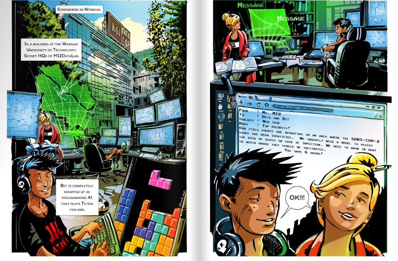
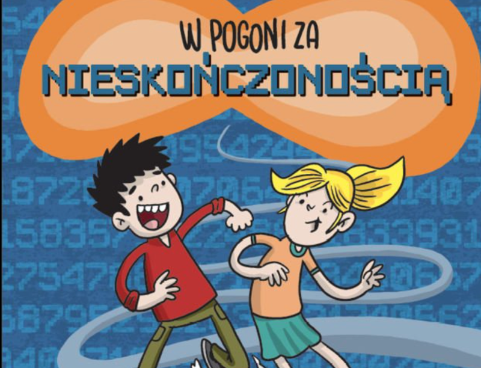
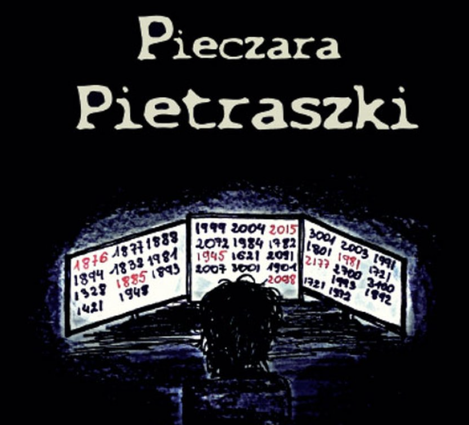

# MI² Education {-}

The demand for predictive modelling skills is growing at a furious rate. Part of our mission is to develop human capital so that predictive modelling is applied responsibly and safely.

We take social responsibility seriously and as part of our activities we support the development of data analysis skills among pupils, students and senior professionals alike.

## Teaching {-}

### Data Visualization 21/22 Winter {-}

[Data Visualization Techniques](https://github.com/mini-pw/2022Z-DataVisualizationTechniques) for Data Science studies

- lectures, laboratory, project - Anna Kozak
- laboratory, project - Hubert Baniecki

### Exploratory Data Analysis 20/21 Summer {-}

[Introduction to exploratory data analysis](https://github.com/mini-pw/2021L-ExploratoryDataAnalysis) for Mathematics and data analysis studies

- lectures, laboratory, project - Anna Kozak
- laboratory - *Krzysztof Spaliński*

### Case Studies 20/21 Summer {-}

[Case Studies](https://github.com/mini-pw/2021L-WarsztatyBadawcze) for Data Science studies

- lectures - Katarzyna Woźnica
- [XAI1](https://github.com/mini-pw/2021L-WB-XAI-1) - laboratory, project - Anna Kozak
- [XAI2](https://github.com/mini-pw/2021L-WB-XAI-2) - laboratory, project - Szymon Maksymiuk
- [DL1](https://github.com/mini-pw/2021L-WB-DL-1) - laboratory, project - Weronika Hryniewska
- [DL2](https://github.com/mini-pw/2021L-WB-DL-2) - laboratory, project - Paulina Tomaszewska
- [ML](https://github.com/mini-pw/2021L-WB-ML) - laboratory, project - Hubert Baniecki
- [RashomonML](https://github.com/mini-pw/2021L-WB-RashomonML) - laboratory, project - Katarzyna Woźnica

### Data Visualization 20/21 Winter {-}

[Data Visualization Techniques](https://github.com/mini-pw/2021Z-DataVisualizationTechniques) for Data Science studies

- lectures, laboratory - Alicja Gosiewska
- project - Hubert Baniecki

### Case Studies 19/20 Summer {-}

[Case Studies](https://github.com/mini-pw/2020L-WarsztatyBadawcze) for Data Science studies

- lectures - Alicja Gosiewska
- [Imputation](https://github.com/mini-pw/2020L-WarsztatyBadawcze-Imputacja) - laboratory, project - Katarzyna Woźnica
- [Reproducibility of scientific papers](https://github.com/mini-pw/2020L-WarsztatyBadawcze-Reprodukowalnosc) - laboratory, project - Alicja Gosiewska
- [Interpretability](https://github.com/mini-pw/2020L-WarsztatyBadawcze-InzynieriaCech) - laboratory, project - Katarzyna Kobylińska

### Interpretable Machine Learning 19/20 Summer {-}

[Interpretable Machine Learning](https://github.com/pbiecek/InterpretableMachineLearning2020) for Data Science studies

- lectures, project - Przemysław Biecek

### Data Visualization 19/20 Summer {-}

[Data Visualization](https://github.com/mini-pw/2020L-WizualizacjaDanych) for Data Science studies

- lectures, project - Michał Burdukiewicz

## Beta Bit {-}

<a href="https://betaandbit.github.io/RML/">The Hitchhiker's Guide to Responsible Machine Learning</a>

Przemysław Biecek, Anna Kozak, Aleksander Zawada.

<i>2021</i>

<a href="https://www.wuw.pl/product-pol-8576-Wykresy-unplugged.html">Wykresy unplugged</a>

Przemysław Biecek, Ewa Baranowska, Piotr Sobczyk

Fundacja Naukowa SmarterPoland.pl <i>2018</i>

<a href="https://www.wuw.pl/product-pol-8579-W-pogoni-za-nieskonczonoscia.html">W pogoni za nieskończonością</a>

Przemysław Biecek, Łukasz Maciejewski, Tomasz Samojlik, Sebastian Szpakowski.

Fundacja Naukowa SmarterPoland.pl <i>2018</i>

<a href="https://www.empik.com/jak-dlugo-zyja-muffinki-biecek-przemyslaw,p1135934167,ksiazka-p">Jak długo żyją Muffinki?</a>

Przemysław Biecek.

<i>2016</i>

<a href="https://www.empik.com/pieczara-pietraszki-chudzian-magdalena-biecek-przemyslaw,p1119203030,ksiazka-p">Pieczara Pietraszki</a>

Magda Chudzian, Przemysław Biecek.

<i>2015</i>

