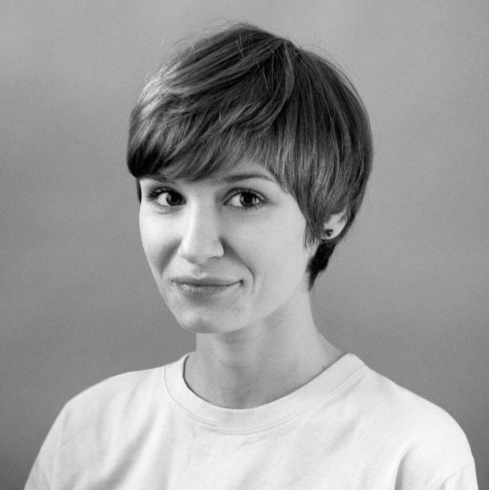
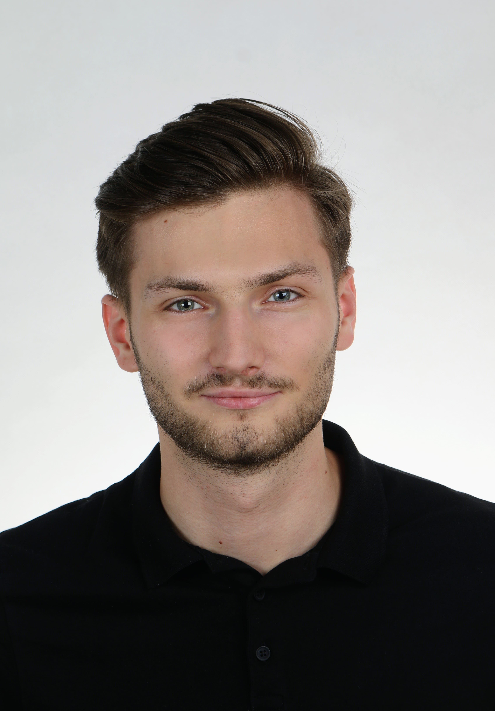

```{r setup, include=FALSE}
options(
  htmltools.dir.version = FALSE, formatR.indent = 2, width = 55, digits = 4
)
output <- knitr::opts_knit$get("rmarkdown.pandoc.to")
is.html = !is.null(output) && output == "html"
```
# MI²DataLab {-}
<script>
document.body.classList.add("index-page")
</script>

MI² is a group of mathematicians and computer scientists that love to play with data.
We are spread between [Warsaw University of Technology](https://www.pw.edu.pl/engpw) and [University of Warsaw](https://en.uw.edu.pl).

DataLab is our creative space, place in which we have workshops, seminars and some experiments. Feel free to jump in. Here we are forging new ideas, creating tools, solving problems, doing consulting and sharing our positive attitude.

#### Mission {-}

Machine learning is like atomic energy. **We develop leaders, skills, methods, tools and good practices so that predictive models can be deployed responsibly and sustainably**.

#### Vision {-}

MI² is a group of experts supporting global initiatives aimed at responsible and sustainable machine learning. We support the development of future leaders of responsible machine learning through internships, PhDs, postdoctoral fellowships and so on. We seek for research grants and business projects to conduct both scientific and applied research. We develop and maintain software and infrastructure necessary to build responsible and sustainable ML. We develop cooperation with international teams working on similar topics. We support companies to implement best practices related to responsible modelling in their operation. We conduct workshops and training on responsible predictive modelling.


## The Team  {-}
<script>
document.querySelector(".page-inner section > *:first-child").classList.add("team-layout")
document.body.classList.add("team-page")
document.body.classList.add("two-columns")

 $(function() {
      // Thanks to Mark Avery
      // http://stackoverflow.com/questions/8191015/how-do-i-lay-out-my-content-divs-in-a-similar-manner-to-facebook-timeline
      var adjustArticleHeights = (function () {

        var leftColumnHeight = 0,
          rightColumnHeight = 0,
          $articles = $('.masonry > *');

        for (var i = 0; i < $articles.length; i++) {

          if (leftColumnHeight > rightColumnHeight) {
            rightColumnHeight += $articles.eq(i).addClass('right').outerHeight(true);
          } else {
            leftColumnHeight += $articles.eq(i).outerHeight(true);
          }
        }

        return $articles;
      })();
    });
</script>

<div id="team-cover-img"></div>

#### Members {-}

* [Przemysław Biecek](the-team.html#przemysław-biecek), PhD, DSc (Team Leader)
* [Hubert Baniecki](the-team.html#hubert-baniecki), MSc student
* [Mustafa Cavus](the-team.html#mustafa-cavus), PhD
* Adrianna Grudzień, BSc student
* [Mateusz Grzyb](the-team.html#mateusz-grzyb), BSc
* [Stanisław Giziński](the-team.html#stanisław-giziński), MSc student
* [Weronika Hryniewska](the-team.html#weronika-hryniewska), PhD student
* [Anna Kozak](the-team.html#anna-kozak), MSc
* [Mateusz Krzyziński](the-team.html#mateusz-krzyziński), BSc student
* [Stanisław Łaniewski](the-team.html#stanisław-łaniewski), PhD student
* [Piotr Piątyszek](the-team.html#piotr-piątyszek), BSc student
* [Hubert Ruczyński](the-team.html#hubert-ruczyński), BSc student
* [Barbara Rychalska](the-team.html#barbara-rychalska), PhD student
* [Nuno Sepúlveda](https://www.immune-stats.net), PhD
* [Bartek Sobieski](the-team.html#bartek-sobieski), BSc student
* [Tomasz Stanisławek](the-team.html#tomasz-stanisławek), PhD
* [Hoang Thien Ly](the-team.html#hoang-thien-ly), BSc student
* [Paulina Tomaszewska](the-team.html#paulina-tomaszewska), PhD student
* [Jakub Wiśniewski](the-team.html#jakub-wiśniewski), BSc
* [Katarzyna Woźnica](the-team.html#katarzyna-woźnica), PhD student


#### Collaborators {-}

* Przemysław Bombiński, PhD, MD
* [André Fonseca](https://www.immune-stats.net), PhD student
* Katarzyna Kobylińska, PhD student
* Marcin Luckner, PhD
* [João Malato](https://www.immune-stats.net), PhD student
* Bartek Pieliński, PhD, DSc
* [Hanna Piotrowska](the-team.html#hanna-piotrowska), MA
* Elżbieta Sienkiewicz, PhD
* Julian Sienkiewicz, PhD
* Patryk Szatkowski, PhD student, MD

#### Summer Interns {-}

* Patryk Słowakiewicz, BSc student
* Mikołaj Spytek, BSc student
* Adrian Stańdo, BSc student
* Mateusz Stączek, BSc student
* Piotr Wilczyński, BSc student

#### Alumni {-}

* Piotr Czarnecki, MSc
* Alicja Gosiewska, MSc
* Maria Kałuska, BSc student
* Marcin Kosiński, MSc
* Wojciech Kretowicz, BSc
* Michał Kuźba, MSc
* Szymon Maksymiuk, BSc
* Tomasz Mikołajczyk, PhD
* Katarzyna Pękala, MSc
* Adam Rydelek, BSc
* Bartosz Sawicki, BSc student
* Michał Sokólski, MSc
* Szymon Szmajdziński, BSc student
* Zuzanna Trafas, BSc student
* Kinga Ułasik, BSc student
* Anna Wróblewska, PhD
* Hanna Zdulska, BSc
* Artur Żółkowski, BSc student

<div class="masonry">
### Przemysław Biecek {-}


My personal mission is to enhance human capabilities by supporting them through access to data-driven and knowledge-based predictions. I execute it by developing methods and tools for responsible machine learning, trustworthy artificial intelligence and reliable software engineering.

I work as an associate professor at [Warsaw University of Technology](http://www.mini.pw.edu.pl/) and the [University of Warsaw](https://www.mimuw.edu.pl/). I graduated in software engineering and mathematical statistics and now work on model visualisation, explanatory model analysis, predictive modelling and data science for healthcare. In 2016, I formed the research group MI² which develops methods and tools for predictive model analysis.

Google Scholar: [Af0O75cAAAAJ](https://scholar.google.pl/citations?user=Af0O75cAAAAJ)

GitHub: [pbiecek](https://github.com/pbiecek)

LinkedIn: [pbiecek](https://www.linkedin.com/in/pbiecek/)


### Hubert Baniecki {-}


Master's student in Data Science at Warsaw University of Technology. Developing and maintaining open-source Python & R packages for explainability of predictive models. Researching explainable machine learning, responsibility, evaluation and adversarial attacks.

Google Scholar: [H72DRC0AAAAJ](https://scholar.google.pl/citations?user=H72DRC0AAAAJ)

GitHub: [hbaniecki](https://github.com/hbaniecki)

LinkedIn: [hbaniecki](https://www.linkedin.com/in/hbaniecki)
  
  
### Mustafa Cavus {-}


I work as an assistant professor at [Warsaw University of Technology](http://www.mini.pw.edu.pl/) and the [Eskisehir Technical University](https://www.eskisehir.edu.tr/). I joined the MI² DataLab as a post-doc researcher in 2021. I work on explainable artificial intelligence and AutoML.

Google Scholar: [I63d1WIAAAAJ&hl](https://scholar.google.com.tr/citations?user=I63d1WIAAAAJ&hl)

GitHub: [mcavus](https://github.com/mcavs)

LinkedIn: [mcavus](https://www.linkedin.com/in/mustafacavusphd)

Twitter: [mcavus](https://twitter.com/mustafa__cavus)


### Stanisław Giziński {-}


A Research Software Engineer and student of Machine Learning at Faculty of Mathematics Informatics and Mechanic, University of Warsaw. His work in the lab focuses on using natural language processing and network analysis to better understand the spread of AI public policies. Interested also in applying machine learning in bioinformatics.

Google Scholar: [Stanisław Giziński](https://scholar.google.com/citations?user=QVXc3jAAAAAJ)

GitHub: [Gizzio](https://github.com/Gizzio)

LinkedIn: [stanislaw-gizinski](https://www.linkedin.com/in/stanislaw-gizinski/)


### Weronika Hryniewska{-}


PhD candidate in computer science at Warsaw University of Technology. Interested in deep learning modelling on medical images in the context of explainability and responsible AI.

Google Scholar: [aJeg3IQAAAAJ](https://scholar.google.pl/citations?user=aJeg3IQAAAAJ)

GitHub: [Hryniewska](https://github.com/Hryniewska)

LinkedIn: [weronikahryniewska](https://www.linkedin.com/in/weronikahryniewska)


### Anna Kozak {-}


Graduated in mathematical statistics at Warsaw University of Technology. Interested in explainable artificial intelligence and data visualization. Organizes projects related to education.

Google Scholar: [JIrqf9kAAAAJ](https://scholar.google.pl/citations?user=JIrqf9kAAAAJ)

GitHub: [kozaka93](https://github.com/kozaka93)

LinkedIn: [kozakanna](https://www.linkedin.com/in/kozakanna)

  
### Mateusz Krzyziński {-}


BSc student in Data Science at Warsaw University of Technology. Interested in explainable artificial intelligence, machine learning on graphs and data visualization.

Google Scholar: [i_r7EUgAAAAJ](https://scholar.google.com/citations?user=i_r7EUgAAAAJ)

GitHub: [krzyzinskim](https://github.com/krzyzinskim)

LinkedIn: [krzyzinskim](https://www.linkedin.com/in/krzyzinskim/)
  
  
### Stanisław Łaniewski {-}


PhD student in Quantitative Psychology and Economics at University of Warsaw, Machine Learning Researcher at MI2 Data Lab, Msc in Actuarial Science and Mathematical Finance at University of Amsterdam, former Quantitative Researcher at Flow Traders
His research focuses on enhancing classical methods used in discrete choice and finance with machine learning and how to apply them to explain behavioral phenomena and heuristics. He is also keen on finding balance between best predictive models and their explainability. Avid gamer who applies statistical techniques to deepen the understanding of best strategies
  
LinkedIn: [Stanisław-Łaniewski](https://www.linkedin.com/in/stanislawlaniewski/)

  
### Piotr Piątyszek {-}


Undergraduate Data Science student at Warsaw University of Technology. Works as a research software engineer on enhancing accessibility and completeness of explainable AI. During pandemic contributes to a system of monitoring covid variants.

Github: [piotrpiatyszek](https://github.com/piotrpiatyszek)


### Barbara Rychalska {-}


PhD candidate in computer science at Warsaw University of Technology. Mainly interested in deep learning for natural language processing (NLP), recommender systems and graph-based learning.

Google Scholar: [Wp0wHJoAAAAJ](https://scholar.google.com/citations?user=Wp0wHJoAAAAJ)

LinkedIn: [Barbara-Rychalska](https://www.linkedin.com/in/barbara-rychalska-97825634/)

  
### Bartek Sobieski {-}


BSc student in Mathematics and Data Analysis at Warsaw University of Technology. Interested in deep learning and hyperparameter optimization.

GitHub: [sob1eski](https://github.com/sob1eski)
  
  
### Tomasz Stanisławek {-}


PhD candidate in computer science at Warsaw University of Technology. Mainly interested in deep learning for natural language processing (NLP).

Google Scholar: [gq8NY_UAAAAJ](https://scholar.google.pl/citations?user=gq8NY_UAAAAJ)

GitHub: [tstanislawek](https://github.com/tstanislawek/)

LinkedIn: [Tomasz-Stanisławek](https://pl.linkedin.com/in/tomasz-stanis%C5%82awek-91092729/)


### Paulina Tomaszewska {-}


PhD candidate in Computer Science at Warsaw University of Technology. Gained experience in AI at leading universities during: Deep Learning Summer School at Tsinghua University (China), one-semester exchange at Nanyang Technological University (Singapore) and research internships at Gwangju Institute of Science and Technology (South Korea) and Institute of Science and Technology (Austria). Mainly interested in Deep Learning, Computer Vision and Transfer Learning.

Google Scholar: [eO245iMAAAAJ](https://scholar.google.com/citations?user=eO245iMAAAAJ)

LinkedIn: [paulina-tomaszewska](https://www.linkedin.com/in/paulina-tomaszewska-2a8517109/)


### Hoang Thien Ly {-}


Bachelor student in Maths and Data Analysis at Warsaw University of Technology. Interested in working with data, and learning explainable artificial intelligence methods.

Google Scholar: [JkysewYAAAAJ](https://scholar.google.com/citations?hl=en&authuser=1&user=JkysewYAAAAJ)
  
GitHub: [lhthien09](https://github.com/lhthien09)

LinkedIn: [hthienly](https://www.linkedin.com/in/hthienly/)


### Jakub Wiśniewski {-}


Research Software Engineer and third year Data Science student at Warsaw University of Technology. Developer of tools for bias detection and fairness. Currently researching responsible applications of deep learning. President of Data Science Science Club at WUT.

Google Scholar: [_6eQsXMAAAAJ](https://scholar.google.com/citations?user=_6eQsXMAAAAJ)

GitHub: [jakwisn](https://github.com/jakwisn)

LinkedIn: [jakwisn](https://www.linkedin.com/in/jakwisn)


### Katarzyna Woźnica {-}


PhD candidate in computer science at Warsaw University of Technology. Graduated in mathematical statistics. Interested in automated machine learning especially in hyperparameter tuning for tabular data. Carrying statistical analysis and predictive modelling for healthcare.

Google Scholar: [tAQS1gQAAAAJ](https://scholar.google.pl/citations?user=tAQS1gQAAAAJ)

GitHub: [woznicak](https://github.com/woznicak)

LinkedIn: [woznicak](https://www.linkedin.com/in/woznicak)


<!-- ### Hanna Zdulska {-}

</p>

Software engineer and Data Science BSc student at Warsaw University of Technology. Experienced in web scraping, interested in natural language processing (NLP) and legal status of Artificial Intelligence. Beginner chess players.</p>

GitHub: [HaZdula](https://github.com/hazdula)

LinkedIn: [Zdulskah](https://www.linkedin.com/in/zdulskah/) -->


### Hanna Piotrowska {-}



Information designer, focusing mainly on data visualization, branding and book design, with a strong interest in Data Science and perception studies. Winner of numerous awards, including The Kantar Information Is Beautiful Awards, HOW International Design Awards, Polish Graphic Design Awards and KTR.

LinkedIn: [hanna-piotrowska](https://www.linkedin.com/in/hanna-piotrowska-2536214b/)

Twitter: [hannapio](https://twitter.com/hannapio)

Behance: [hannapio](https://www.behance.net/hannapio).


### Mateusz Grzyb {-}


A BSc Data Science student at Warsaw University of Technology. Interested in artificial intelligence, data visualization and metaheuristic optimization.

GitHub: [PlentyCoups](https://github.com/PlentyCoups)


<!-- ### Bartosz Sawicki {-}


Works towards BSc degree in Data Science at Warsaw University of Technology. Interested in data visualization.

GitHub: [SawickiBartosz](https://github.com/SawickiBartosz)


### Szymon Szmajdziński {-}


Data Science student at Warsaw University of Technology. Machine learning enthusiast. Interested in automated machine learning and explainable artificial intelligence.

GitHub: [Szmajsz](https://github.com/Szmajasz)

LinkedIn: [szymszmaj](https://www.linkedin.com/in/szymszmaj/) -->


### Hubert Ruczyński {-}


Works towards Bachelor's degree in Data Science at Warsaw University of Technology. Interested in Maching Learning, Neural Networks and Fairness.

GitHub: [HubertR21](https://github.com/HubertR21)

<!-- 
### Zuzanna Trafas {-}


A third-year Computer Science student at Poznan University of Technology. Interested in explainable artificial intelligence and computer vision.

GitHub: [Zuzanna-Trafas](https://github.com/Zuzanna-Trafas)

LinkedIn: [zuzanna-trafas](https://www.linkedin.com/in/zuzanna-trafas/)


### Kinga Ułasik {-}


A Data Science student at the Warsaw University of Technology. Interested in data vizualization, machine learning and programming. Besides studies, an astronomy amateur and a musician.

GitHub: [ARUMHC](https://github.com/ARUMHC)


### Maria Kałuska {-}


Pursuing a Bachelor's degree in Data Science at Warsaw University of Technology. Interested in machine learning and neural networks for computer vision.

GitHub: [kaluskam](https://github.com/kaluskam)

LinkedIn: [Maria-Kałuska](https://www.linkedin.com/in/marysia-ka%C5%82uska-ba16bb208/)


### Artur Żółkowski {-}



Bachelor Data Science student at Warsaw University of Technology. Interested in machine learning and explainable artificial intelligence.

GitHub: [arturzolkowski](https://github.com/arturzolkowski)

LinkedIn: [azolkowski](https://www.linkedin.com/in/azolkowski/)

### Alicja Gosiewska {-}


PhD student in Computer Science at Warsaw University of Technology, holds a Master’s degree in Mathematics. Interested in Machine Learning benchmarks and eXplainable Artificial Intelligence for tabular data.

Google Scholar: [YiwwR6EAAAAJ](https://scholar.google.pl/citations?user=YiwwR6EAAAAJ&hl=pl)

GitHub: [agosiewska](https://github.com/agosiewska)

LinkedIn: [alicja-gosiewska](https://www.linkedin.com/in/alicja-gosiewska/)

### Michał Kuźba {-}


Data Scientist, holds a Master's degree in Computer Science from University of Warsaw. Interested in NLP, conversational explanations of AI, human aspects of Machine Learning and geographical data.  

Google Scholar: [9RU1uwcAAAAJ](https://scholar.google.com/citations?user=9RU1uwcAAAAJ)

GitHub: [kmichael08](https://github.com/kmichael08)

LinkedIn: [michalkuzba](https://www.linkedin.com/in/michalkuzba/)


### Tomasz Mikołajczyk {-}


PhD in social sciences, but in recent years has devoted himself to the area of data analysis and visualization. He is interested in the development of the area of explainable artificial intelligence.

GitHub: [tmikolajczyk](https://github.com/tmikolajczyk)

LinkedIn: [tomasz-mikolajczyk-ds](https://www.linkedin.com/in/tomasz-mikolajczyk-ds) -->

</div>

## Open Positions {-}

We have open call for [HOMER](https://www.mi2.ai/research-grants.html#homer-2020-2025) and [xLungs](https://www.mi2.ai/research-grants.html#x-lungs-2021-2024) projects for following positions. If you are interested in any of them please send your CV and Motivation Letter to przemyslaw.biecek at gmail.com. We reserve the right to contact only selected candidates.

### Summer Internships 22 {-}


This year we have 6 projects open for summer internships!

The time to apply is **May 8 - by the end of the day**.

**Applications must be submitted through [the form](https://forms.gle/qsuiwg3xYFLdQGyZ6).**

Project descriptions can be found on [this GitHub page](https://github.com/pbiecek/mi2-summer-22/blob/main/README.md).

Each of the projects assumes a full-time commitment for two months during the summer break. Exact dates can be specified with a mentor.

The internships are funded from HOMER and xLungs projects.

Participation in the internship is connected with the fix remuneration in the amount of 6k PLN (umowa o dzieło). 


### Deep Learning Engineer {-}

Required:

* Background in Computer Science, Mathematics, Statistics or similar. 
* Experience in Deep Learning for 2d/3d image data (*torch is a plus)
* Interest in medical applications

Scope of work:

* Training of machine learning models for tabular and image data
* Responsible ML solutions for the healthcare domain

Offer:

* Excellent atmosphere for work in a young and very active lab
* Conferences and training budget
* Short visits in cooperating abroad group
* Access to CPU / GPU clusters
* Elastic working hours that can be combined with studies

### Research Software Engineer {-}

Required:

* Background in Computer Science, Mathematics, Statistics or similar. 
* Experience in Scientific Programming (R and/or Python and/or C++)
* Interest in applications, machine learning and explainable artificial intelligence.

Scope of work:

* Training of machine learning models for tabular and image data
* Interpretable solutions for tabular and image data
* Interactive interfaces 
* Responsible ML solutions for the healthcare domain

Offer:

* Excellent atmosphere for work in a young and very active lab
* Conferences and training budget
* Short visits in cooperating abroad group
* Access to CPU / GPU clusters
* Elastic working hours that can be combined with studies

### Post-doc {-}

Required:

* PhD in Computer Science, Mathematics, Statistics or similar. (Different background? We encourage cross-domain short research visits).
* Experience in Scientific Programming (R and/or Python and/or C++)
* Good track of Scientific Records

Scope of work:

* Automated model exploration
* Interpretable measures for model performance
* Meta/transfer learning in automated model development
* Automated model validation
* Experiments with XAI for deep learning

Offer:

* Excellent atmosphere for work in a young and very active ML lab
* Conferences and training budget
* Short visits in cooperating abroad group
* Access to CPU / GPU clusters
* Full-time job at Warsaw University of Technology
* plus results-driven extras
* contract for 6 months (short visit) / 12 months or 24 months (long visit)

### ARES {-}

PhD position funded by the PRELUDIUM BIS grant ARES (*Attack-Resistant Explanations toward Secure and trustworthy AI*).

Machine learning explainability, fairness, robustness, and security are critical elements of trustworthy Artificial Intelligence, an area of strategic importance. The main goals:

* develop adversarial attacks on state-of-the-art explanations to investigate  vulnerabilities and limitations of the existing explainability and fairness approaches  in machine learning, and
* introduce novel robust explanations that are stable against manipulation and intuitive to evaluate.

These are targeted at progressing responsible machine learning toward a secure and trustworthy adoption of AI solutions. 

**Join us, and change the way how ML models will be explained and evaluated.**


### PhD student {-}

Required:

* MSc in Computer Science, Mathematics, Statistics or similar.  (Different background? We encourage cross-domain research short visits).
* Experience in Scientific Programming (R and/or Python and/or C++)
* Strong motivation 

Scope of work:

* Automated model exploration
* Concept drift detection
* Reinforcement learning for Human-Centered AI
* Knowledge extraction from representations
* Experiments with XAI for deep learning

Offer:

* Excellent atmosphere for work in a young and very active ML lab
* Conferences and training budget
* Short visits in cooperating abroad group
* Access to CPU / GPU clusters
* PhD scholarship
* plus results-driven extras
* contract for 6 months (short visit) / 3.5 years (full PhD)


## Contact {-}

Our rooms: 

* 44 (DataLab - separate entrance in front of the main entrance)
* 316 (xLungs)
* 317 (HOMER) 


Faculty of Mathematics and Information Science,

Warsaw University of Technology,

Koszykowa 75,

00-662 Warszawa

VAT: PL 5250005834


<iframe src="https://www.google.com/maps/embed?pb=!1m18!1m12!1m3!1d2444.1647099791685!2d21.005092115735344!3d52.
22222527975892!2m3!1f0!2f0!3f0!3m2!1i1024!2i768!4f13.1!3m3!1m2!1s0x471ecd5d7938e739%3A0x64ab06034e05e767!
2sMI2%20DataLab!5e0!3m2!1spl!2spl!4v1622669807972!5m2!1spl!2spl" width="900px" height="600" style="border:0;"
allowfullscreen="" loading="lazy"></iframe>

<script>
document.body.classList.add("contact-page")
</script>
